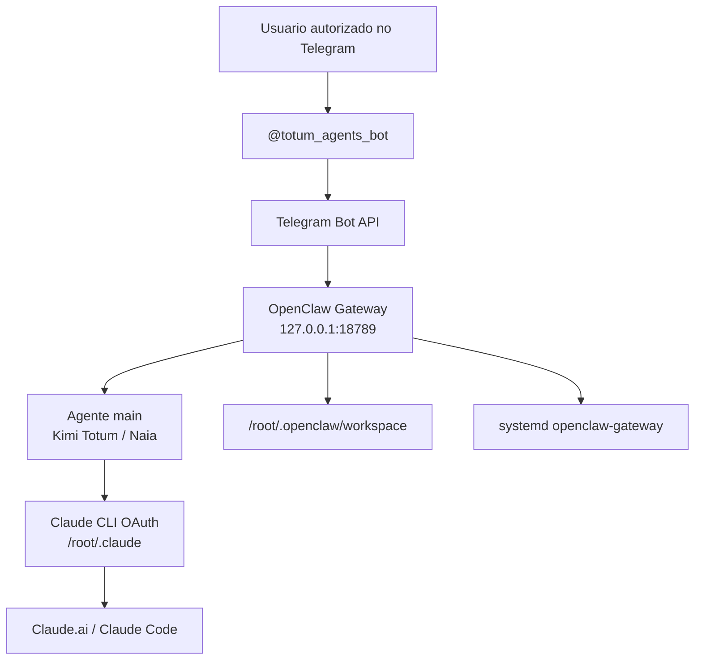
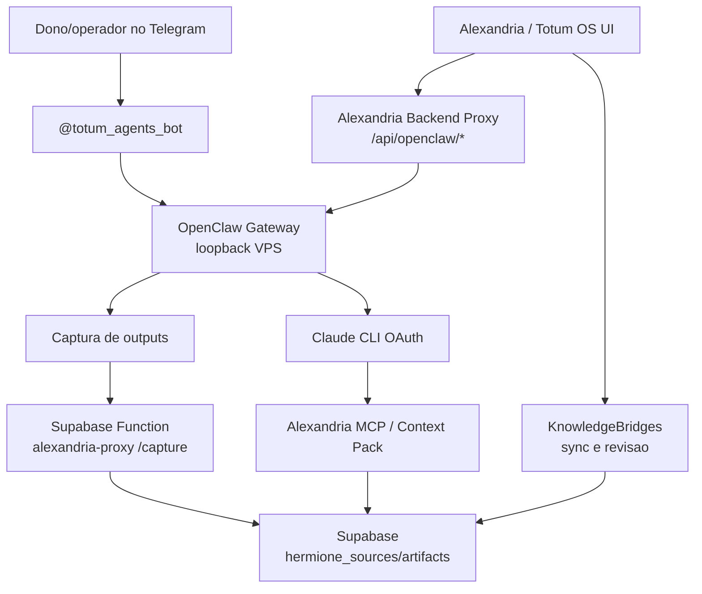

# Analise profunda: OpenClaw + Telegram + Alexandria + Totum OS

Data: 2026-05-16  
Documento-base analisado: `/Users/israellemos/Documents/Pixel Systems/Integração NAIA/OPENCLAW_TELEGRAM_TOTUM_RUNBOOK.md`  
Repositorio local analisado: `/Users/israellemos/Documents/Pixel Systems/Alexandria`  
Repositorio de referencia local: `/Users/israellemos/Documents/Pixel Systems/Totum-OS`  
URL publica verificada por contexto local: `https://alexandria.grupototum.com`  

Observacao: o link publico `https://github.com/grupototum/Totum-OS` retornou 404 no acesso web desta sessao. A analise abaixo usa a copia local do Totum-OS/Alexandria e os arquivos reais do workspace como fonte tecnica.

## 1. Resumo executivo

O que foi feito na VPS muda a arquitetura da Alexandria de uma biblioteca passiva para um sistema operacional de agentes com canal vivo.

O runbook instalou e validou um agente OpenClaw rodando 24/7 em `panel.grupototum.com` / `187.127.4.140`, exposto apenas em loopback (`127.0.0.1:18789`), com canal Telegram `@totum_agents_bot`, autenticacao Claude via OAuth/Claude CLI e controle de acesso por `Telegram user_id`. Isso e uma boa decisao de seguranca: o canal publico e Telegram, mas o gateway OpenClaw nao fica publico na internet.

A conclusao principal: OpenClaw nao deve ser tratado como substituto da Alexandria. Ele deve ser tratado como runtime de execucao. Alexandria deve continuar sendo a fonte de verdade, memoria governada, catalogo de skills, POPs, decisoes e contexto. Totum OS/Alexandria deve virar o painel de controle e camada de governanca desse runtime.

Em termos simples:

- Alexandria = memoria, contexto, politicas, artefatos e governanca.
- Totum OS = interface operacional e control plane.
- OpenClaw = runtime autonomo 24/7.
- Telegram = canal humano rapido.
- Claude CLI OAuth = cerebro primario atual.
- n8n/Supabase Edge Functions = automacao, captura e ponte institucional.

## 2. Estado final detectado no runbook

O runbook afirma que os seguintes pontos foram validados:

- `openclaw-gateway` esta `enabled` e `active`.
- Gateway escuta em `127.0.0.1:18789` e `::1:18789`.
- Telegram esta configurado e habilitado no OpenClaw.
- Bot Telegram responde no chat.
- Claude OAuth foi autenticado na VPS.
- OpenClaw respondeu via Claude depois da liberacao de uso extra.
- Sudo temporario do usuario `totum` foi removido.
- Memoria PostgreSQL foi criada, mas plugin de memoria ainda nao ficou plenamente disponivel.
- Gateway nao esta publicado diretamente na internet.

Esse estado e coerente com uma primeira implantacao segura: o agente ja conversa, mas a memoria persistente e a integracao com Alexandria ainda precisam virar produto.

## 3. Leitura arquitetural

### 3.1. Arquitetura atual do runbook



### 3.2. Arquitetura desejada com Alexandria



### 3.3. Papel correto de cada camada

| Camada | Papel | O que nao deve virar |
| --- | --- | --- |
| Telegram | Interface rapida e canal humano | Fonte de verdade ou banco de memoria |
| OpenClaw | Executor autonomo com tools e canal | Lugar onde todo conhecimento fica escondido |
| Claude CLI OAuth | Modelo principal enquanto ha quota | Unico ponto de continuidade de contexto |
| Alexandria | Memoria governada, POPs, skills, decisoes, contexto | Apenas uma tela estatica ou wiki |
| Totum OS | Control plane: status, execucoes, aprovacoes, configuracao | Um frontend que chama segredos direto do browser |
| Supabase | Persistencia, artifacts, functions e audit trail | Dump sem politica de acesso |
| n8n | Orquestracao e automacao externa | Memoria principal |

## 4. Como isso se encaixa na ideia da Alexandria

A ideia mais forte para Alexandria e: todo agente deve operar com contexto governado. O runbook confirma essa necessidade porque o agente no Telegram ja consegue agir, mas hoje sua memoria real esta fragmentada:

- `/root/.openclaw/workspace`
- sessoes do OpenClaw
- Claude CLI OAuth e historico de execucao
- Telegram chat
- possivel PostgreSQL `openclaw_memory`
- Alexandria/Hermione artifacts no Supabase
- docs e skills no repo

Sem integracao, o agente responde, mas nao necessariamente responde com a memoria institucional certa. Com integracao, o agente passa a operar assim:

1. Usuario manda mensagem no Telegram.
2. OpenClaw recebe e identifica agente/sessao.
3. Antes de responder, consulta Alexandria para montar um context pack.
4. Claude responde com contexto de POPs, skills, decisoes e politicas.
5. Resultado relevante e capturado de volta para Alexandria.
6. Totum OS mostra status, logs, custos, sessoes, artefatos criados e pendencias de revisao.

Esse loop transforma Alexandria de repositorio de conhecimento em sistema nervoso dos agentes.

## 5. O que ja existe no codigo que ajuda

### 5.1. Alexandria/Totum OS ja tem superfícies de controle

Arquivos relevantes:

- `src/pages/alexandria/OpenClawDashboard.tsx`
- `src/config/openclaw.ts`
- `src/services/openClawClient.ts`
- `src/pages/alexandria/KnowledgeBridges.tsx`
- `src/services/alexandriaKnowledgeSync.ts`
- `src/services/alexandriaBridge.ts`
- `supabase/functions/alexandria-proxy/index.ts`
- `supabase/functions/alexandria-mcp/index.ts`
- `tools/alexandria-claude-mcp/server.mjs`

O produto ja tem a estrutura mental correta:

- painel OpenClaw;
- cliente OpenClaw;
- Alexandria proxy para busca/captura;
- MCP local para Claude;
- KnowledgeBridges para governanca de importacao;
- skills registry e agents registry.

### 5.2. O painel OpenClaw atual ainda esta em modo "browser client"

`src/config/openclaw.ts` assume `VITE_OPENCLAW_URL` e `VITE_OPENCLAW_TOKEN`. Isso funciona para ambientes de dev ou tunnel, mas conflita com a decisao correta do runbook: gateway apenas em loopback.

Problema: se o navegador em `https://alexandria.grupototum.com` tentar chamar `http://127.0.0.1:18789`, ele vai chamar o computador do usuario, nao a VPS. Se tentar chamar `http://187.127.4.140:18789`, isso quebra a decisao de seguranca e ainda sofre mixed content/CORS.

Conclusao: o frontend nao deve falar direto com OpenClaw. Ele deve falar com o backend Alexandria, e o backend fala com OpenClaw por rede interna/host gateway.

### 5.3. Alexandria proxy ja suporta captura

`supabase/functions/alexandria-proxy/index.ts` ja possui acao `capture`, com token `ALEXANDRIA_CAPTURE_TOKEN`, sanitizacao basica, hash de conteudo e criacao de:

- `hermione_sources`
- `hermione_artifacts`
- `hermione_artifact_versions`
- `hermione_artifact_sources`
- `hermione_consultations`

Isso e praticamente o destino ideal para outputs do OpenClaw/Telegram, desde que haja politica de o que capturar automaticamente e o que mandar para revisao.

### 5.4. Alexandria MCP ja suporta contexto para Claude

`tools/alexandria-claude-mcp/server.mjs` e `supabase/functions/alexandria-mcp/index.ts` ja dao tres ferramentas:

- `alexandria_search`
- `alexandria_get_artifact`
- `alexandria_context_pack`

Esse e o caminho certo para Claude Desktop/Cowork. Para OpenClaw na VPS, ha duas opcoes:

- configurar OpenClaw/Claude CLI para usar uma ferramenta equivalente, se o runtime suportar MCP/tools;
- criar um pre-hook no backend/proxy que busca `context_pack` e injeta no prompt enviado ao agente.

## 6. Principal lacuna de arquitetura

A lacuna nao e "instalar mais coisa". A lacuna e governanca entre runtime e memoria.

Hoje:

```text
Telegram -> OpenClaw -> Claude
```

Desejado:

```text
Telegram -> OpenClaw -> Alexandria Context -> Claude -> Alexandria Capture -> Revisao no Totum OS
```

Sem esse ciclo, o agente pode virar uma ilha. Com esse ciclo, ele vira um membro do sistema operacional Totum.

## 7. Riscos criticos

### 7.1. Segredos no frontend

O codigo atual ainda tem padroes como:

- `VITE_OPENCLAW_TOKEN`
- `VITE_TELEGRAM_BOT_TOKEN`
- `VITE_N8N_API_KEY`
- `VITE_SUNA_API_KEY`

Mesmo quando nao ha valor real commitado, o padrao `VITE_*` significa que, se configurado em producao, o segredo pode ir para o bundle do navegador.

Recomendacao: qualquer token de Telegram, OpenClaw, n8n, Suna e chaves administrativas deve ir para backend/Edge Function, nunca para `VITE_*`, salvo chaves publicas como anon key do Supabase.

### 7.2. Gateway loopback nao e acessivel pelo browser

O runbook protege corretamente o gateway em `127.0.0.1:18789`. Portanto, qualquer tela web precisa de um proxy server-side.

Recomendacao:

- criar `api/routes/openclaw.js` ou endpoints em `api/server.js`;
- usar `OPENCLAW_GATEWAY_URL=http://host.docker.internal:18789`;
- usar `OPENCLAW_GATEWAY_TOKEN` apenas no container/backend;
- exigir usuario autenticado/admin;
- auditar execucoes.

### 7.3. Claude CLI OAuth e otimo, mas tem limite operacional

O runbook mostra erros de quota:

- `You're out of extra usage`
- diferenca entre Anthropic API e Claude CLI OAuth

Recomendacao: Claude CLI pode ser primary, mas producao precisa de fallback:

```text
Primary: Claude CLI OAuth / Sonnet
Fallback pago: GLM/Z.ai ou outro provider API
Emergency: Ollama local para resposta basica/status
```

### 7.4. Memoria OpenClaw ainda nao esta madura

O PostgreSQL foi criado, mas `memory-core` ficou `unavailable`. Isso reforca que a memoria canonica nao deve depender do plugin nesse momento.

Recomendacao: usar Alexandria/Supabase como memoria governada canonica; deixar memoria interna OpenClaw como cache/sessao.

### 7.5. Persona inconsistente

O runbook nota que o bot respondeu como "Naia" apesar de agente "Kimi Totum". Isso e sintoma de identidade distribuida em arquivos locais.

Recomendacao: Alexandria deve ter um "Agent Identity Registry" canonico, e o workspace OpenClaw deve ser gerado/sincronizado a partir dele.

## 8. Proposta de integracao por fases

### Fase 0: Documentar e congelar estado validado

Objetivo: transformar o runbook em fonte operacional versionada dentro da Alexandria/Totum OS.

Acoes:

- copiar runbook para `docs/ops/OPENCLAW_TELEGRAM_TOTUM_RUNBOOK.md` ou referenciar como fonte externa;
- registrar status atual em `docs/ops/OPENCLAW_STATUS_2026-05-16.md`;
- manter segredos fora do repo;
- registrar quais comandos foram validados e quais dependem de root.

Resultado: qualquer pessoa entende o estado atual sem pedir contexto no chat.

### Fase 1: Proxy server-side OpenClaw dentro da Alexandria

Objetivo: permitir que o painel Alexandria monitore OpenClaw sem expor gateway.

Endpoints recomendados:

```text
GET  /api/openclaw/health
GET  /api/openclaw/status
GET  /api/openclaw/channels
POST /api/openclaw/agent
POST /api/openclaw/restart-request
```

Regras:

- somente backend chama `127.0.0.1:18789` ou `host.docker.internal:18789`;
- frontend nunca recebe token OpenClaw;
- `POST /api/openclaw/agent` deve exigir autenticacao e permissao;
- comandos destrutivos devem virar "request", nao acao direta, ate haver RBAC.

Mudancas tecnicas provaveis:

- `docker-compose.yml`: adicionar `extra_hosts: ["host.docker.internal:host-gateway"]`;
- env backend: `OPENCLAW_GATEWAY_URL=http://host.docker.internal:18789`;
- env backend: `OPENCLAW_GATEWAY_TOKEN=...`;
- `src/config/openclaw.ts`: trocar modo browser por `VITE_ALEXANDRIA_API_BASE` ou chamadas relativas `/api/openclaw/*`;
- `src/services/openClawClient.ts`: chamar backend Alexandria, nao OpenClaw direto.

### Fase 2: Captura de outputs OpenClaw para Alexandria

Objetivo: todo output relevante do bot vira artefato revisavel.

Fluxo:

```text
OpenClaw/Telegram result -> capture adapter -> alexandria-proxy /capture -> Hermione artifacts -> revisão no Totum OS
```

Politica recomendada:

- capturar automaticamente apenas summaries, decisoes, POPs, prompts e planos;
- nunca capturar tokens, dados pessoais intimos, payloads brutos ou conversas inteiras sem sanitizacao;
- toda captura entra com `status=review`;
- tags padrao: `openclaw`, `telegram`, `kimi-totum`, `naia`, `capture`.

Payload conceitual:

```json
{
  "title": "Resposta Telegram - Kimi Totum - 2026-05-16",
  "sourceName": "telegram/openclaw/kimi-totum",
  "artifactType": "summary",
  "status": "review",
  "tags": ["openclaw", "telegram", "kimi-totum"],
  "metadata": {
    "channel": "telegram",
    "agent": "main",
    "telegramUserIdHash": "hash-ou-redacted",
    "sessionId": "openclaw-session-id"
  },
  "content": "Resumo sanitizado da execucao..."
}
```

### Fase 3: Context pack Alexandria antes da resposta

Objetivo: agente responde com contexto institucional.

Fluxo:

```text
Mensagem recebida -> classificar intencao -> buscar Alexandria context_pack -> injetar no prompt -> responder
```

Exemplos:

- Usuario: "qual POP para subir deploy?"
- OpenClaw busca Alexandria por `POP deploy Alexandria Totum OS`.
- Claude recebe contexto com POPs, checklist e restricoes.
- Resposta e curta no Telegram, com link ou resumo.

Implementacao possivel:

- se OpenClaw suporta tools/MCP: registrar `alexandria_context_pack`;
- se nao suporta: criar adapter no backend que chama `alexandria-mcp` antes de `openclaw agent`;
- para Telegram direto, usar workspace files gerados periodicamente a partir de Alexandria.

### Fase 4: Identity registry e persona canonica

Objetivo: resolver Kimi Totum vs Naia vs outros nomes.

Criar uma fonte unica:

```text
Alexandria Agent Identity Registry
```

Campos sugeridos:

- `agent_id`
- `display_name`
- `aliases`
- `owner`
- `channels`
- `persona`
- `allowed_tools`
- `memory_policy`
- `capture_policy`
- `fallback_model_policy`

Aplicacao:

- gerar `/root/.openclaw/workspace/SOUL.md`;
- gerar `/root/.openclaw/workspace/IDENTITY.md`;
- atualizar `src/agents/*/character.json`;
- refletir em `src/pages/agents`.

### Fase 5: Observabilidade no Totum OS

Objetivo: a UI mostrar o estado real do runtime.

Cards recomendados para `/alexandria/openclaw`:

- Gateway: online/offline/latencia.
- Telegram: configured/enabled/last update.
- Claude CLI: authenticated/quota warning.
- Systemd: active/enabled/restarts.
- Memory: available/unavailable.
- Captures: ultimas capturas para Alexandria.
- Security: loopback, allowlist, permissions.
- Backups: ultimo backup e hash.

### Fase 6: Fallbacks e autonomia

Objetivo: manter utilidade quando Claude CLI falhar.

Politica:

- Se Claude CLI quota falhar: avisar no Telegram e usar fallback.
- Se OpenClaw cair: systemd reinicia; cron opcional monitora.
- Se Alexandria/Supabase cair: responder sem contexto canonico, mas marcar `context_unavailable`.
- Se captura falhar: persistir localmente em fila e reenviar depois.

## 9. Modelo de governanca de memoria

### 9.1. Niveis de memoria

| Nivel | Onde fica | Uso | Retencao |
| --- | --- | --- | --- |
| Sessao curta | OpenClaw sessions | Continuidade de conversa recente | curta |
| Workspace operacional | `/root/.openclaw/workspace` | Persona, instrucoes e arquivos locais | controlada |
| Memoria canonica | Alexandria/Supabase | POPs, decisoes, skills, artifacts | permanente/revisada |
| Memoria pessoal sensivel | fora da Alexandria | Dados intimos/privados | nao importar |
| Logs tecnicos | journalctl, `/tmp/openclaw` | debug e auditoria | rotacionada |

### 9.2. Politica de entrada na Alexandria

Usar o modelo verde/amarelo/vermelho ja presente em `src/services/alexandriaBridge.ts`:

- Verde: operacional, POP, skill, prompt, decisao, contexto sanitizado.
- Amarelo: preferencia pessoal ou rotina permitida, entra apenas resumida.
- Vermelho: token, senha, financeiro pessoal, saude, familia, dados bancarios, journals brutos.

Aplicar essa politica a outputs do Telegram e do OpenClaw antes de capturar.

## 10. O que validar com NotebookLM e Claude Cowork

Perguntas fortes para jogar no NotebookLM/Claude:

1. Esta arquitetura separa corretamente memoria, runtime, canal e control plane?
2. O gateway OpenClaw deve permanecer apenas em loopback ou vale um tunnel autenticado?
3. Qual e o melhor lugar para o proxy OpenClaw: backend Express da Alexandria, Supabase Edge Function, n8n ou Nginx interno?
4. Como evitar que `VITE_*` exponha tokens operacionais no frontend?
5. Como modelar capturas Telegram/OpenClaw em `hermione_artifacts` sem poluir a Alexandria?
6. O `openclaw_memory` deve ser abandonado, usado como cache ou integrado ao Supabase?
7. Qual formato ideal para Agent Identity Registry?
8. Como criar fallback Claude CLI -> GLM/Z.ai -> Ollama sem quebrar personalidade e politicas?
9. Quais comandos Telegram deveriam existir de verdade?
10. Qual deveria ser o fluxo de aprovacao antes de um output do agente virar conhecimento canonico?

## 11. Recomendacao de desenho final

Minha recomendacao e adotar este desenho:

```text
Telegram e OpenClaw sao runtime/canal.
Alexandria e memoria canonica.
Totum OS e control plane.
Supabase functions sao fronteira externa segura.
Backend Express da Alexandria e ponte interna para o OpenClaw loopback.
```

Isso preserva a seguranca do runbook e da um caminho claro para produto.

## 12. Backlog priorizado

### P0 - Antes de expor mais controle na UI

- Remover dependencia de chamadas diretas browser -> OpenClaw.
- Garantir que tokens Telegram/OpenClaw/n8n/Suna nao sejam `VITE_*` em producao.
- Criar proxy server-side `/api/openclaw/health`.
- Mostrar status real do gateway no painel OpenClaw.
- Documentar runbook em `docs/ops`.

### P1 - Integracao Alexandria real

- Criar captura OpenClaw -> `alexandria-proxy /capture`.
- Criar context injection Alexandria -> OpenClaw.
- Adicionar pagina de revisao de capturas.
- Padronizar tags e metadados de capturas.
- Criar Agent Identity Registry.

### P2 - Operacao e observabilidade

- Mostrar systemd status, last restart e logs recentes.
- Mostrar Claude CLI auth/quota de forma segura.
- Mostrar Telegram bot status sem expor token.
- Criar backup health card.
- Criar healthcheck agendado e backup agendado.

### P3 - Autonomia avancada

- Fallback GLM/Z.ai.
- Fallback Ollama para emergencia.
- Comandos Telegram reais: `/status`, `/help`, `/reset`, `/capture`, `/context`.
- Fila local de capturas quando Supabase estiver indisponivel.
- Sincronizacao automatica de persona do Agent Identity Registry para OpenClaw workspace.

## 13. Possivel implementacao tecnica inicial

### 13.1. Variaveis backend

```bash
OPENCLAW_GATEWAY_URL=http://host.docker.internal:18789
OPENCLAW_GATEWAY_TOKEN=...
ALEXANDRIA_CAPTURE_URL=https://cgpkfhrqprqptvehatad.supabase.co/functions/v1/alexandria-proxy/capture
ALEXANDRIA_CAPTURE_TOKEN=...
```

### 13.2. Endpoints Alexandria backend

```text
GET /api/openclaw/health
  Retorna health do gateway.

GET /api/openclaw/status
  Retorna status resumido, preferencialmente via OpenClaw CLI ou API.

POST /api/openclaw/message
  Envia mensagem para agente, com opcao de context pack Alexandria.

POST /api/openclaw/capture
  Captura output selecionado para Alexandria.
```

### 13.3. Mudancas frontend

`OpenClawDashboard` deveria trocar:

```text
fetch(VITE_OPENCLAW_URL + /health)
```

por:

```text
fetch('/api/openclaw/health')
```

E o `openClawClient` deveria falar com a Alexandria API, nao com o gateway.

## 14. Decisao importante

Nao recomendo publicar `127.0.0.1:18789` para internet via Cloudflare Tunnel sem uma camada adicional de politica. Mesmo com token, isso aumenta muito a superficie de ataque de um runtime capaz de executar ferramentas.

O melhor equilibrio:

- OpenClaw segue loopback.
- Alexandria backend no mesmo VPS vira proxy controlado.
- UI chama Alexandria backend.
- Telegram segue como canal autorizado.
- Supabase functions cuidam de memoria/captura.

## 15. Conclusao

O trabalho feito na VPS esta no caminho certo e deve ser incorporado como a primeira celula viva da Alexandria operacional.

A frase de produto seria:

> Alexandria nao e so onde o conhecimento mora; e o sistema que governa o que os agentes sabem, podem fazer, registram e aprendem.

O OpenClaw com Telegram e Claude CLI entrega a parte de acao. A Alexandria entrega memoria e governanca. O Totum OS entrega controle e visibilidade. Integrados, eles formam um runtime de agencia com contexto, execucao e aprendizado.

O proximo passo tecnico mais seguro e pequeno: criar um proxy server-side `/api/openclaw/health` e adaptar o painel OpenClaw para ler esse endpoint. Depois disso, implementar captura de outputs para `alexandria-proxy /capture`.
