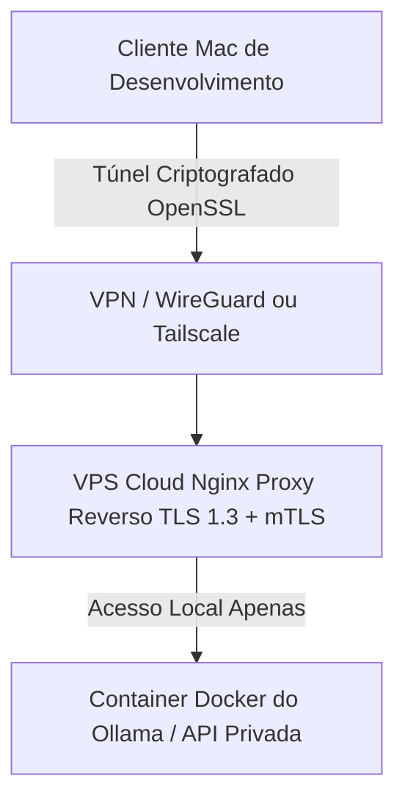

# Schema de Infraestrutura: VPS Security Architecture

Baseado nas diretrizes do Playbook Vibe Code para garantir conformidade em processamento de IAs (Ollama) lidando com PII (Informação de Identificação Pessoal).

## Arquitetura de Comunicação (Mac Local ↔ VPS Cloud)

## Stack Tecnológica Obrigatória
- **Transporte:** TLS 1.3 Mútuo (mTLS) garantindo criptografia end-to-end.
- **Autenticação:** Certificados cliente e servidor; Apenas endpoints pré-autorizados acessam.
- **Rede:** WireGuard ou Tailscale. NUNCA expor API bruta (`0.0.0.0`) diretamente na Internet aberta.
- **Aplicação:** Nginx + Lua com limite rigoroso de rate limit e auditoria contínua de logs.

## Comandos de Verificação
Para assegurar a saúde criptográfica da comunicação VPS:

1. **Geração de CA:** `openssl genrsa -out ca-key.pem 4096` (permissão 600).
2. **Checagem TLS:** `openssl s_client -connect HOST:PORT` para confirmar Ciphersuites fortes.
3. **Validação VPN:** `wg show` confirmando handshake assíncrono regular.
4. **Alerta Crítico:** Rotação de certificados mandatório via Cron a cada 90 dias, disparando alerta 7 dias antes do vencimento.
